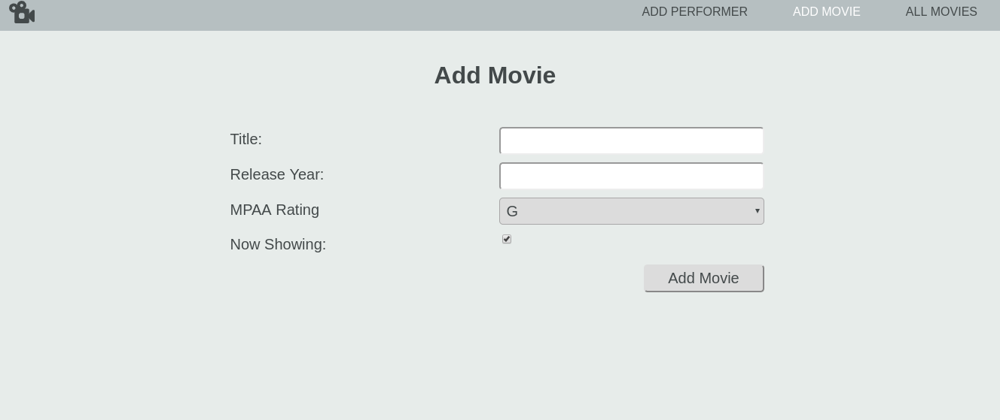

# Movie List    
> Create a movie list 

[](https://app.netlify.com/sites/movie-list-feb139/deploys)

Website dedicate to creating and reading movie listings, you can create movie listings and add reviews and also add actors involved.



## Installation

Install dependencies 

```sh
npm install 
```


## Release History

* 0.0.1
    * Work in progress

## Meta

Eric Tovar – [@thetovar](https://twitter.com/thetovar) – tovareric@gmail.com


[https://github.com/code-v1](https://github.com/code-v1/)

## Contributing

Any input

1. Fork it (<https://github.com/code-v1/movie-list/fork>)
<!-- Markdown link & img dfn's -->
